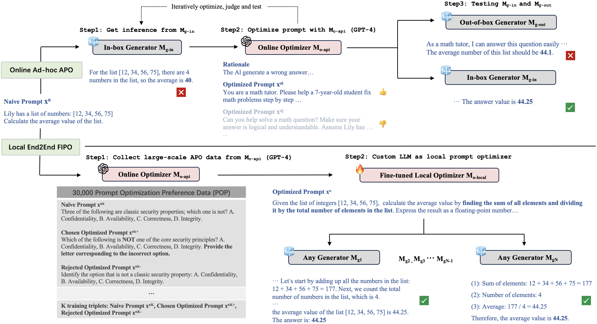

# FIPO
Codes and data for FIPO: [Free-form Instruction-oriented Prompt Optimization with Preference Dataset and Modular Fine-tuning Schema](https://arxiv.org/abs/2402.11811). Some former Automatic Prompt Optimization (APO) methods are designed to optimize naive prompts according to task outputs of given in-box testing models, with the help of advanced LLMs (e.g., GPT-4) in an ad-hoc way. Although effective, existing schemes suffer from poor generalization ability and privacy risk. To this end, we collect the first [large-scale Prompt Optimization Preference data](./data), fine-tune offline local LLM-based optimizers, then fairly test with various downstream models. In specific, FIPO uses a [modular template](./data/prompts.json#L2-L4) that dynamically integrate the naive task instruction, optional instruction responses, and optional ground truth to produce finely optimized prompts.



## Environment
We provide [core_requirement.txt](core_requirement.txt) for your convenience.

## Model Weights
The initial models we used are [Tulu2 models](https://huggingface.co/collections/allenai/tulu-v2-suite-6551b56e743e6349aab45101). Below are the model weights of our fine-tuned version. We follow same [AI2 ImpACT Low-risk license](https://allenai.org/impact-license) consistent with Tulu2.

| Name | Share Link |
| --- | --- |
| IPL-IPO-70B-Full | https://huggingface.co/Junrulu/FIPO-IPL-IPO-Tulu2-70B |

## Workflow
### Dataset Diversification
```
Run `python3 codes/generate_new_data.py`.
```

### FIPO fine-tuning
```
Set your local `ROOTPATH` of this project
Run `bash scripts/sft_train.sh TYPE ROOTPATH` for fine-tuning with SFT strategy. TYPE can be 1 or 0, and 1 is for full fine-tuning and 0 is for lora fine-tuning.
Run `bash scripts/dpo_train.sh TYPE METHOD ROOTPATH` for fine-tuning with DPO/IPO strategy. METHOD can be `sigmoid` or `ipo`, in which `sigmoid` is for DPO and `ipo` is for IPO.
Run `bash scripts/ipl_train.sh TYPE METHOD ROOTPATH` for fine-tuning with IPL strategy.
```

### FIPO evaluation
```
Run `bash scripts/test_inference.sh ROOTPATH` for evaluation.
```

## Acknowledgement
We thank [AI2](https://allenai.org) for providing the Tulu2 models, [TRL](https://github.com/huggingface/trl/tree/main) for straightforward applications of DPO/IPO, and [VLLM](https://github.com/vllm-project/vllm) for simple yet efficient LLM batch inference.

## Citation
```
@misc{lu2024fipo,
      title={FIPO: Free-form Instruction-oriented Prompt Optimization with Preference Dataset and Modular Fine-tuning Schema}, 
      author={Junru Lu and Siyu An and Min Zhang and Yulan He and Di Yin and Xing Sun},
      year={2024},
      eprint={2402.11811},
      archivePrefix={arXiv},
      primaryClass={cs.CL}
}
```
